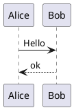

# PlantUML

Renders ` ```plantuml ` fenced code blocks as inline SVG diagrams.

## Configuration

Configure the plug from your SilverBullet `CONFIG` page using Space-Lua's `config.set()`.  
Set **either** `serverURL` **or** `executable` — if both are present, `serverURL` wins.

### Remote server (default)

If no config is provided, the plug uses the public server at `https://plantuml.com/plantuml`.

```lua
config.set("plantuml.serverURL", "https://plantuml.com/plantuml/")
```

Point this at your own PlantUML server if you don't want to send diagram source to a third party.

> [!WARNING]
> **URL path:**  
> Some PlantUML servers serve the UMLs on either the root path (i.e. `/svg/…`), or on the `plantuml/` path (i.e. `/plantuml/svg/…`) – configure it accordingly.  
> When using the [offical plantuml/plantuml-server](https://hub.docker.com/r/plantuml/plantuml-server) Docker image, the `plantuml/` URL path must be omitted.

> [!NOTE]
> **Permissions:**  
> Requires the `fetch` permission (already declared in `plantuml.plug.yml`).

### Local executable

```lua
config.set("plantuml.executable", "/usr/local/bin/plantuml-wrapper")
```

The executable is invoked with a single argument: the base64-encoded UML source. 
It must print the resulting SVG to stdout. 

A minimal wrapper script:

```sh
#!/bin/sh
echo "$1" | base64 -d | /usr/local/bin/plantuml -tsvg -pipe
```

> [!NOTE]
> **Permissions:**  
> Requires the `shell` permission (already declared in `plantuml.plug.yml`).

## Usage

Wrap PlantUML source in a fenced code block tagged `plantuml`:

````markdown

````

The block is rendered as an SVG diagram in live preview.  
Click anywhere on the rendered diagram to return to source mode.

